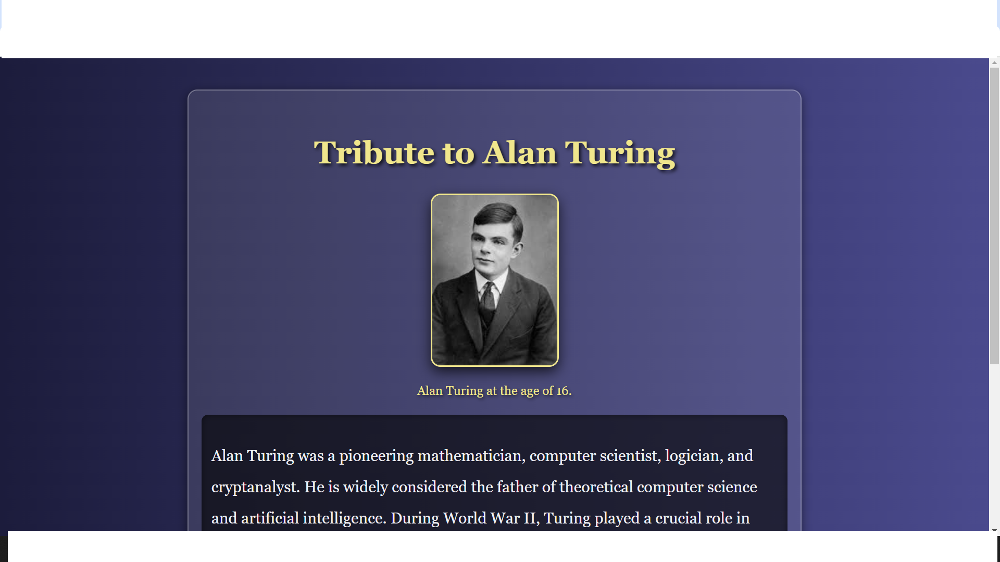

# Tribute-Page

This is a simple tribute page dedicated to Alan Turing, a pioneering mathematician, computer scientist, logician, and cryptanalyst. The page provides a brief overview of his life and contributions to the field of computer science and artificial intelligence.

## Table of Contents

- [Introduction](#introduction)
- [Features](#features)
- [Technologies Used](#technologies-used)
- [Setup](#setup)
- [License](#license)

## Introduction

Alan Turing is widely considered the father of theoretical computer science and artificial intelligence. During World War II, he played a crucial role in breaking the German Enigma code, which significantly contributed to the Allied victory. Despite his immense contributions, Turing faced persecution due to his homosexuality, which was then criminalized in the UK. He tragically died in 1954. Today, Turing is celebrated for his groundbreaking work and his enduring impact on modern technology.

## Features

- A brief biography of Alan Turing
- An image of Alan Turing
- A link to learn more about Alan Turing

## Technologies Used

- HTML
- CSS

## Setup

To view the tribute page, simply open the `index.html` file in your web browser.

## License

This project is licensed under the MIT License. See the [LICENSE](LICENSE) file for details.